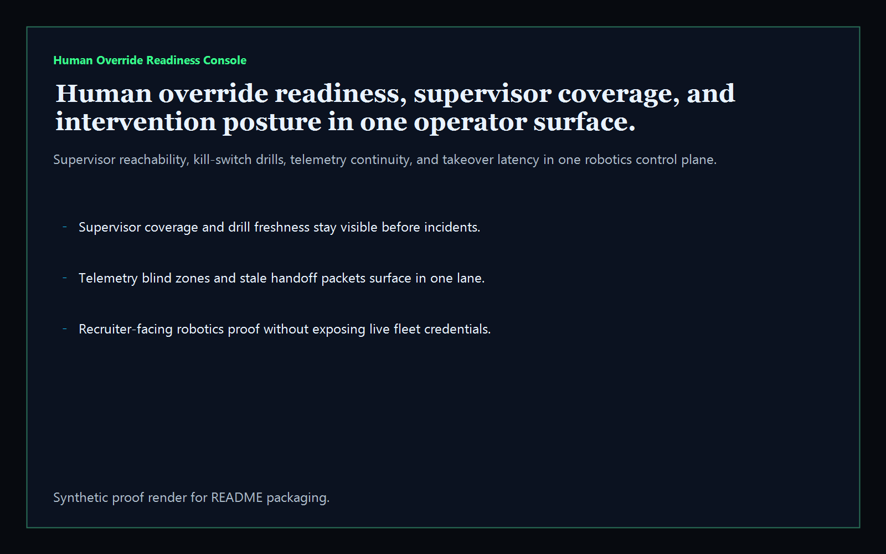
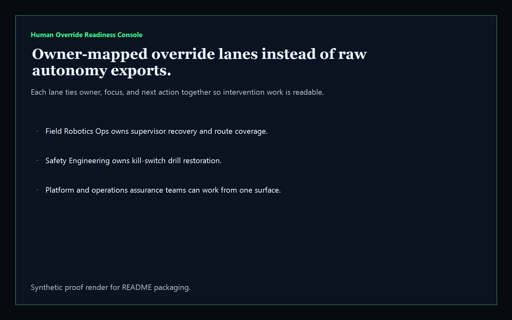
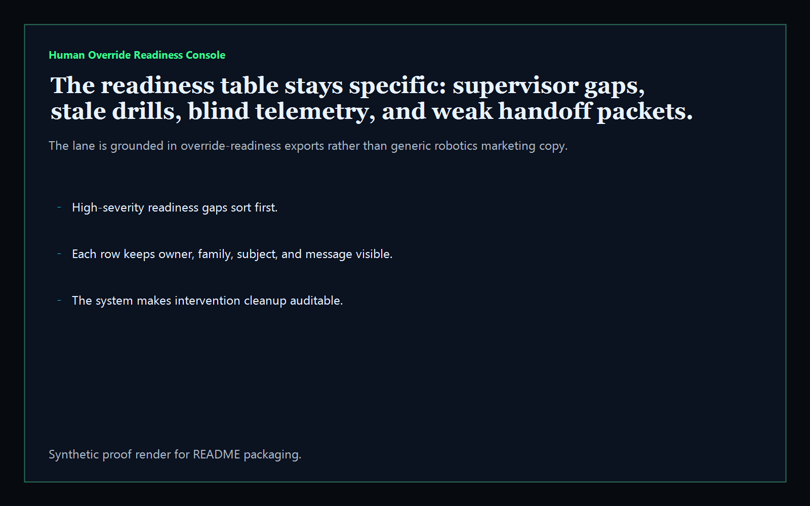
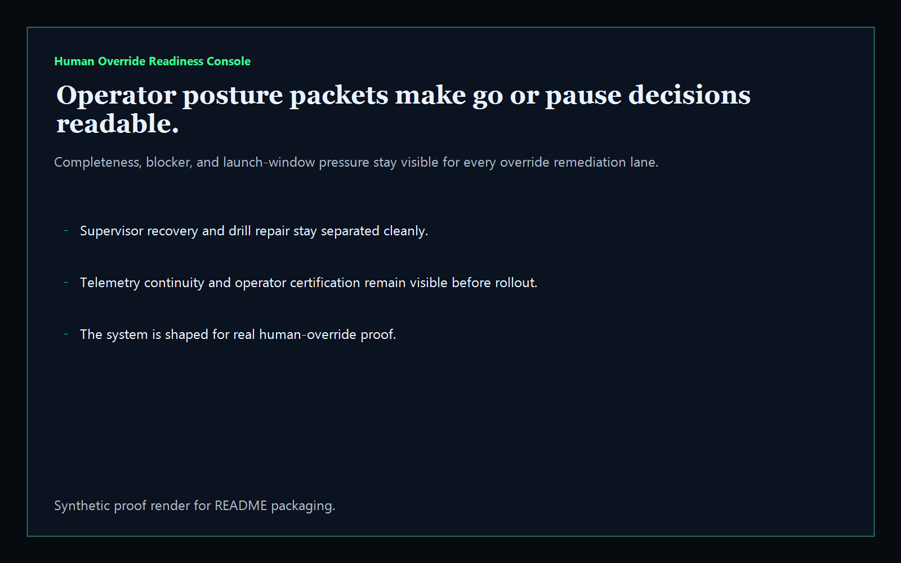

> ## ⚠️ Archived 2026-05-31 — superseded
>
> This repo is archived. The shape it set out to solve was already covered (and shipped) on the apex tool surface:
>
> **→ [https://kineticgain.com/trust/ai-tabletop/](https://kineticgain.com/trust/ai-tabletop/)** — AI Incident Tabletop Kit + AI System Card (human-review-point field)
>
> The apex surface is browser-only, no login, no telemetry, vanilla JS, aligned in vocabulary with NIST AI RMF / EU AI Act / ISO 42001 / SOC 2 / ISO 27018 / GDPR (never "compliant"/"certified" without external attestation).
>
> No migration needed — this repo never had production users; it was Codex-shipped scaffolding that landed in parallel with (and unaware of) the apex executive-tools layer.

---

# Human Override Readiness Console

[](https://github.com/mizcausevic-dev/human-override-readiness-console/actions/workflows/ci.yml)
[](./LICENSE)
[](https://github.com/mizcausevic-dev/human-override-readiness-console/actions/workflows/pages.yml)

TypeScript operator surface for robotics human-override readiness, supervisor coverage, intervention latency, drill freshness, and telemetry-safe handoff posture.

## Why this exists

- Robot fleets can look healthy right up until a human has to take over. The dangerous gap is usually not the raw incident. It is stale override playbooks, thin supervisor coverage, weak takeover latency, and blind telemetry during escalation.
- Reliability teams need one surface that shows where human override is actually ready, where it is ceremonial, and which routes or cells should pause until the intervention path is trustworthy.
- Mature autonomy programs need more than mission success charts. They need operator-safe evidence that a real person can step in cleanly when the automation edge fails.

## Why this matters (KG Embedded tie-back)

This repo demonstrates the human-override readiness primitive for robotics buyers: supervisor coverage, intervention queue health, drill evidence, and handoff-safe posture in one TypeScript control plane. Kinetic Gain Embedded extends this into in-product autonomy review, escalation-safe telemetry, and operator analytics layers, see [kineticgain.com/embedded](https://kineticgain.com/embedded).

## Routes

- `/`
- `/override-lane`
- `/readiness-gaps`
- `/operator-posture`
- `/verification`
- `/docs`

## API

- `/api/dashboard/summary`
- `/api/override-lane`
- `/api/readiness-gaps`
- `/api/operator-posture`
- `/api/verification`
- `/api/sample`

## Screenshots






## Local development

```powershell
cd human-override-readiness-console
npm install
npm run verify
```

Open:
- [http://127.0.0.1:5521/](http://127.0.0.1:5521/)
- [http://127.0.0.1:5521/override-lane](http://127.0.0.1:5521/override-lane)
- [http://127.0.0.1:5521/readiness-gaps](http://127.0.0.1:5521/readiness-gaps)
- [http://127.0.0.1:5521/operator-posture](http://127.0.0.1:5521/operator-posture)
- [http://127.0.0.1:5521/verification](http://127.0.0.1:5521/verification)

## Validation

- `npm run verify`
- `npm run prerender`
- `npm run render:assets`

## Production status

| Aspect | Status |
|--------|--------|
| CI | Node build · lint · typecheck · tests · demo · smoke |
| Test coverage | Service, render, and app route coverage |
| License | [AGPL-3.0-or-later](./LICENSE) |
| Security | [SECURITY.md](./SECURITY.md) |
| Deploy | Static prerender → **https://override.kineticgain.com/** |

## Docs

- [Architecture](./docs/architecture.md)
- [Origin](./docs/ORIGIN.md)
- [Kinetic Gain Embedded tie-back](./docs/KINETIC_GAIN_EMBEDDED.md)
- [Changelog](./CHANGELOG.md)

## Part of the Kinetic Gain Suite

Operator surface in the [Kinetic Gain Suite](https://suite.kineticgain.com/) — a portfolio of buyer-readable control planes spanning robotics, biotech, FinTech, compliance evidence, and operator workflows. Apex: [kineticgain.com](https://kineticgain.com/).